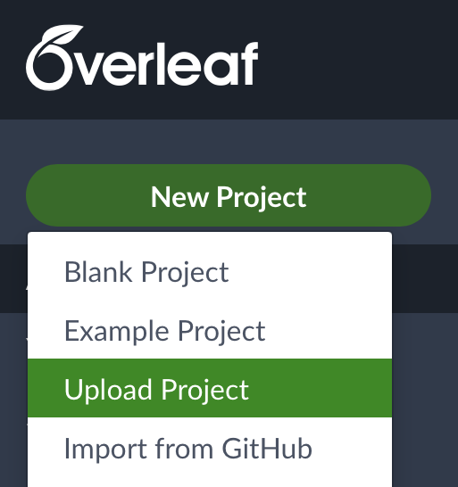
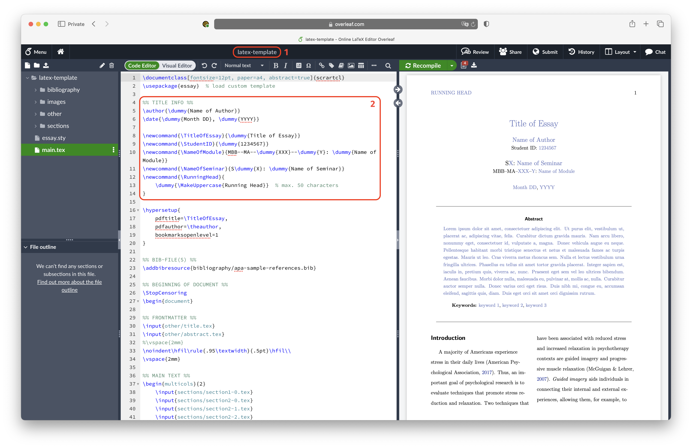
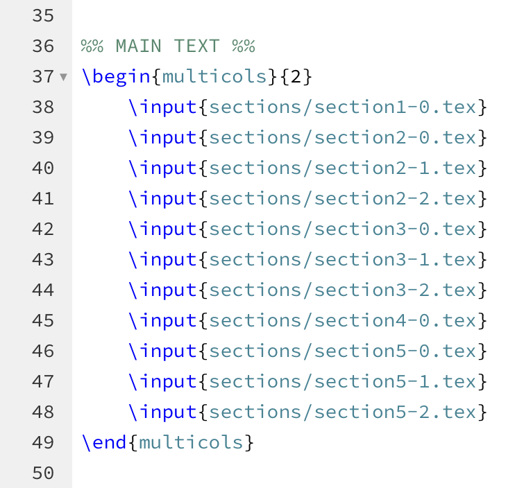
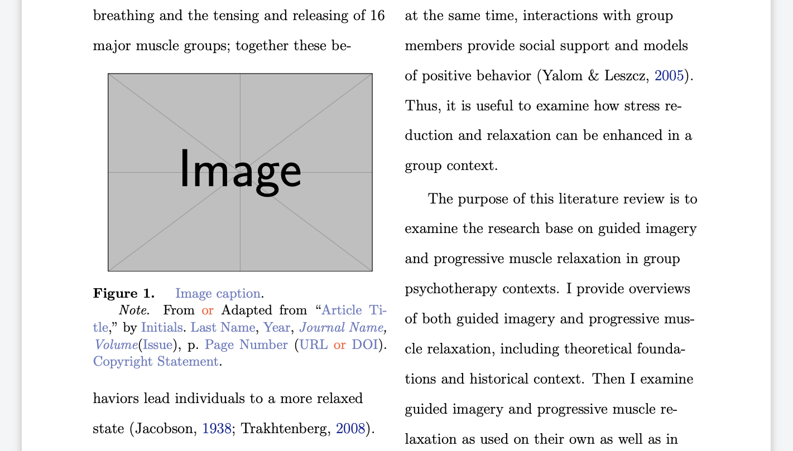

# LaTeX Template 

**
<a rel="cc:attributionURL" href="https://github.com/mrvnthss/mind-brain-behavior/tree/main/latex-template">This work</a> by <a rel="cc:attributionURL dct:creator" property="cc:attributionName" href="https://github.com/mrvnthss">Marvin Theiss</a> is marked with <a href="https://creativecommons.org/publicdomain/zero/1.0/?ref=chooser-v1" target="_blank" rel="license noopener noreferrer" style="display:inline-block;">CC0 1.0  </a>
**

  
   
  
  
Screenshots of the LaTeX template provided in this repository.

This LaTeX template came about during my studies at Justus Liebig University Giessen. In the *Mind, Brain and Behavior* master's program, I had to write several essays. With a background in mathematics, I never really use Microsoft Word or similar WYSIWYG editors. Instead, I usually work exclusively with LaTeX, mostly through [Overleaf](https://www.overleaf.com). Thus, when it was time to write the first essay for the MBB program, I decided to quickly create my own LaTeX template to use during my studies in Giessen.

This template does *not* follow any particular guidelines regarding margins, paragraph indentation, and the like. Instead, I just went with a two-column layout and tweaked some basic settings until I was happy with the results.

## Table of Contents

- [How to Use This Template](#how-to-use-this-template)
    + [Importing the Template in Overleaf](#importing-the-template-in-overleaf)
    + [Initial Setup](#initial-setup)
    + [Project Structure](#project-structure)
    + [Writing the Essay](#writing-the-essay)
    + [Including Images](#including-images)
- [Disclaimer](#disclaimer)
- [License](#license)

## How to Use This Template

### Importing the Template in Overleaf

To get started, you will need to download the template first. You can download all the necessary files in a ZIP file [by clicking here](https://www.dropbox.com/scl/fi/x4btaprdc23rjhaywxyhk/latex-template.zip?rlkey=6tkce22dy1tcffqfegqf3tfjy&st=z980o2xi&dl=1). To start a new project in [Overleaf](https://www.overleaf.com), simply log in to your account (or register if you don't yet have one), and then click on *New Project* &rarr; *Upload Project*.

    
    
Uploading the template to Overleaf to start a new project.

Finally, simply drag and drop the ZIP file you have just downloaded to create a new project.

### Initial Setup

Once you have created a new project in Overleaf using the template provided in this repo, your screen should look something like this:

    

1. Choose a meaningful name for your project. To do so, hover your mouse over the default name (here: *latex-template*) until a pencil icon appears. Click on it to change the project's name.

2. Under `%% TITLE INFO %%`, enter the information that will be used to create the title page of the essay. Be sure to remove any `\dummy{...}` commands, e.g., if you want to set the date to *May 05, 2024*, replace `\date{\dummy{Month DD}, \dummy{YYYY}}` with `\date{May 05, 2024}`.

### Project Structure

#### The `main.tex` File

This is the file that Overleaf compiles. Essentially, it brings together all of the separate files of the template to create the final PDF.

#### The `essay.sty` File

This file is responsible for the layout of the document. It defines the page margins, the appearance of headers and footers, and much more. It also loads all the packages used by LaTeX.

#### The `bibliography/` Directory

This is where all the `.bib` files needed to generate the list of references are stored. The list of references is generated by the [biblatex](https://www.overleaf.com/learn/latex/Bibliography_management_with_biblatex) package using [APA style](https://apastyle.apa.org/style-grammar-guidelines/references).

#### The `images/` Directory

You guessed it, this is where you place all the images that you want to use in your essay.

#### The `other/` Directory

This directory contains four different files. The **`abstract.tex`** file lets you create an **abstract** for your essay. To do so, simply replace `\dummy{\lipsum[1-1]}` with the appropriate text for your abstract, and then replace `\dummy{keyword 1}, \dummy{keyword 2}, \dummy{keyword 3}` with actual keywords for your essay. If you do *not* want to include an abstract at the beginning of your essay, simply ignore this file, comment out line 31 of the `main.tex` file that says `\input{other/abstract.tex}`, and uncomment the subsequent line.

The **`declaration.tex`** file contains a **declaration of authorship and academic integrity**. Feel free to change this to suit your needs. If not needed, simply comment out line 56 of the `main.tex` file that says `\input{other/declaration.tex}`.

The **`references.tex`** file controls the appearance of the **list of references**. You shouldn't need to change anything here.

Finally, the **`title.tex`** file creates the **title page** of the essay. Feel free to play around with this file to change the appearance of the title page, include additional information, and exclude information that you don't want to include.

#### The `sections/` Directory

This is where you place the `.tex` files containing the content of your essay. See [Writing the Essay](#writing-the-essay) for details.

### Writing the Essay

I have divided all my essays into sections and subsections (which, in rare cases, are further divided into subsubsections). Each subsection is corresponds to an individual `.tex` file that's placed in the `sections/` directory mentioned above. These are included in the final PDF by adding an appropriate `\input{sections/sectionX-Y.tex}` command in the `main.tex` file.

    
    
The main text is split into subsections that are loaded individually.

### Including Images

There are two ways to include images in your essay, either at the top of each page (i.e., spanning across both columns) or as part of the text (i.e., within a single column). Both options are illustrated in the template and should be easy for you to modify/copy. To include your own image, you first need to upload the image file to the `images/` directory and then replace `example-image` with the correct filename in the `\includegraphics[...]{...}` command. Image captions follow the best practices explained [here](https://www.scribbr.com/apa-examples/citing-tables-figures/).

    
    
An image that's placed within a single column.

## Disclaimer

The text used to illustrate this LaTeX template is *not* my own. Instead, it is taken from [this](https://apastyle.apa.org/style-grammar-guidelines/paper-format/student-paper.docx) student sample paper by *Hannah Greenbaum* provided by the *American Psychological Association* at [apastyle.apa.org](https://apastyle.apa.org/style-grammar-guidelines/paper-format/sample-papers). In particular, I do *not* own any copyrights, and the license applied to this template does *not* apply to the text by Hannah Greenbaum used to illustrate the use of the template.

## License

This work has been dedicated to the public domain, and all rights to this work worldwide under copyright law have been waived, including all related and neighboring rights, to the extent allowed by law.

You can copy, modify, distribute and perform the work, even for commercial purposes, all without asking permission. However, when using or citing this work, you should not imply endorsement by the author.

For more detailed information, please review the full [LICENSE](LICENSE) text.
